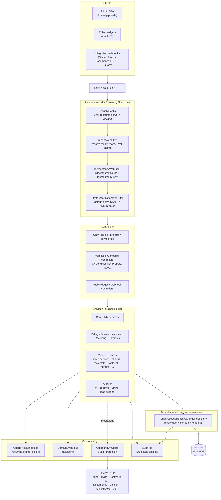

# kmo-digipres-be

The backend for the **KMO Solutions Foundry CRM** — a custom, multi-tenant
CRM / back-office platform built for [KMO Solutions Foundry LLC](https://kmosolutionsfoundry.com).

> **Naming note:** the `digipres` repo name and the `com.kumouri` Java package
> are historical. Treat any "digipres" / "kumouri" reference as a synonym for
> the KMOSF CRM — it is not a separate product.

It is a reactive, end-to-end non-blocking Spring Boot service: multi-tenant by
construction, JWT-authenticated, and organized around a CRM core (contacts,
companies, deals, activities) with billing, quoting, invoicing, contracts,
projects, time & expenses, a service hub, and a large suite of opt-in vertical
and AI modules layered on top.

---

## Stack

| Concern            | Choice                                                                 |
| ------------------ | ---------------------------------------------------------------------- |
| Language / runtime | **Java 21**, Spring Boot **3.5.14**                                    |
| Web                | **Spring WebFlux** (Netty) — reactive, non-blocking end to end         |
| Data               | **MongoDB** via `spring-boot-starter-data-mongodb-reactive`           |
| Security           | Spring Security (reactive) — JWT resource server + OAuth2 client; WebAuthn/passkeys via webauthn4j |
| Scheduling         | **Quartz** (RAM JobStore) + `@Scheduled` for recurring billing / pollers |
| Resilience         | Resilience4j circuit breakers on every outbound integration            |
| Mapping            | MapStruct + Lombok                                                      |
| Files              | AWS SDK v2 (**S3** / S3-compatible object storage)                      |
| PDF                | OpenPDF (quotes, invoices, contracts)                                   |
| Templating         | jmustache (contract / document bodies)                                  |
| ML                 | Smile (lead-scoring v2, no-show risk)                                   |
| API docs           | springdoc-openapi (WebFlux) → committed `docs/api/openapi.json`         |
| Build              | Gradle (wrapper), Java toolchain 21                                     |
| Tests              | JUnit 5, Testcontainers (Mongo), WireMock, ArchUnit, reactor-test      |

---

## Architecture

The request lifecycle is a reactive filter chain in front of thin controllers
that delegate to services; services are the only layer that touches
tenant-scoped repositories, and repositories are automatically constrained to
the caller's tenant.



### Multi-tenancy

Tenancy is the spine of the system. `TenantWebFilter` resolves the tenant from
the request (host or JWT claim) into a `TenantContext` carried on the reactive
context. Every domain entity implements `TenantScoped`, and all repositories
extend `TenantScopedReactiveMongoRepository`, which **automatically injects a
`tenantId` filter into every query and stamps it on every write**. Cross-tenant
reads are impossible through the normal repository surface — `TenantIsolationIT`
is the regression proof.

### Authorization (default-deny)

`StaffAuthorizationWebFilter` is default-deny: an authenticated request reaches
a business endpoint only if it carries the required role. New endpoints are
`STAFF`-gated by default; `/admin/**` and `/integrations/connections/**`
require `ADMIN`. Fine-grained checks use `RoleGuard.requireRole(...)`. Public
widget endpoints and verified webhook paths live under `/public/**` (permitAll
at the filter, then re-secured by token or signature inside the handler).

### Modules

Beyond the CRM core, the platform ships a large set of **opt-in modules**, each
gated by `@ConditionalOnProperty(prefix = "kmosf.modules.<name>")` so a tenant
only runs what it has enabled:

- **Verticals** — `homeservices`, `chairfill` (salon/spa), `realestate`,
  `frontdesk` (health, PHI-free by design), `fieldservice`, `restaurantlight`,
  `salonspa`.
- **Revenue / ops** — `ar` (collections), `proposals` (SOW generator),
  `quoting` (+ QuoteCloser), `nurture`, `responder`, `waitlist`, `dispatch`.
- **AI tools** — `styleconsult`, `stylermatch`, `techcopilot` (RAG), plus the
  shared AI / vision / RAG layer.

### Integrations

Each external system has an adapter under `integration/` behind a Resilience4j
circuit breaker, and every outbound HTTP call passes through `OutboundUrlGuard`
(SSRF protection). Inbound webhooks (Stripe, Documenso, Twilio, Square, GBP) are
signature- or secret-verified and made idempotent via per-integration event
ledgers (insert-first, explicit-boolean idempotency — never a `switchIfEmpty`
double-create).

### Money rails

Billing is the most carefully guarded area. Invoices, recurring invoices,
payments, contracts, and accounting pushes use **ledger-insert-first
idempotency** with compensating deletes so a concurrent or retried fire can
never double-bill, orphan, or lose a record. All Stripe / QuickBooks /
Documenso interactions are sandbox/WireMock in tests — no live key or host is
hardcoded anywhere in the source.

---

## Project layout

```
src/main/java/com/kumouri/kmodigipresbe/
├── config/        # Spring config: security, JWT, Mongo, files, OpenAPI, Quartz
├── security/      # OutboundUrlGuard (SSRF), outbound HTTP hardening
├── tenancy/       # TenantContext, filters, RoleGuard, tenant-scoped repo base
├── controller/    # REST controllers (core CRM, billing, projects, service hub …)
├── service/       # business logic (the only layer that hits repositories)
├── repository/    # tenant-scoped reactive Mongo repositories
├── model/         # domain entities (TenantScoped / Auditable / CustomFieldHost)
├── module/        # opt-in vertical & AI modules (gated by @ConditionalOnProperty)
├── integration/   # external-system adapters (Stripe, Twilio, Documenso, …)
├── scheduling/    # Quartz jobs, recurring-billing spawn, index initializers
├── automation/    # workflow automation engine
├── audit/         # audit-log infrastructure
├── exceptions/    # GlobalErrorHandler + error-code ranges
└── util/
```

---

## Running locally

**Prerequisites:** JDK 21, a running MongoDB (Docker recommended on Windows),
and an SMTP password env var (the app refuses to start without it — see
`SmtpRequiredEnvironmentPostProcessor`).

```powershell
# Start MongoDB (Docker)
docker run -d --name kmosf-mongo -p 27017:27017 mongo:8

# Provide the required SMTP secret, then boot
$env:KMOSF_MAIL_SMTP_PASSWORD = "dev"
./gradlew bootRun
# API on http://localhost:8080/api/v1
```

### Bootstrapping a tenant

Tenant creation is gated behind an `X-Bootstrap-Token` admin header
(`kmosf.bootstrap.token` in `application.properties`). There is no UI for it:

```powershell
curl -X POST http://localhost:8080/api/tenants `
  -H "Content-Type: application/json" `
  -H "X-Bootstrap-Token: $env:KMOSF_BOOTSTRAP_TOKEN" `
  -d '{
    "tenantSlug": "kmosf",
    "tenantDisplayName": "KMO Solutions Foundry",
    "adminEmail": "admin@kmosolutionsfoundry.com",
    "adminPassword": "<pick-a-strong-one>",
    "adminDisplayName": "Ceryce Armstrong"
  }'
```

Then authenticate via `POST /api/v1/auth/login` to receive a JWT. The admin UI
([`kmo-digipres-fe`](../kmo-digipres-fe/)) consumes this same `/api/v1` surface.

---

## Testing

```powershell
./gradlew test          # unit + ArchUnit + Testcontainers integration tests
./gradlew check         # test + OpenAPI drift refresh
```

The integration suite boots a real app against a **Testcontainers MongoDB** and
WireMocks every external API. CI runs the suite across balanced shards on larger
runners; locally, prefer targeted `--tests` batches (a single-fork full run is
Mongo-flaky under load). See [`CLAUDE.md`](CLAUDE.md) for the full engineering
conventions, module index, and error-code ranges.

---

## License

This project is licensed under the **PolyForm Noncommercial License 1.0.0** —
free for personal and other noncommercial use, with **all commercial use
prohibited**. See [`LICENSE`](LICENSE).

Copyright © 2026 KMO Solutions Foundry LLC. All rights reserved except as
expressly granted by the license.

**Commercial licensing** — commercial rights are reserved by the copyright
holder. To license this software for commercial use, contact
[licensing@kmosolutionsfoundry.com](mailto:licensing@kmosolutionsfoundry.com).
